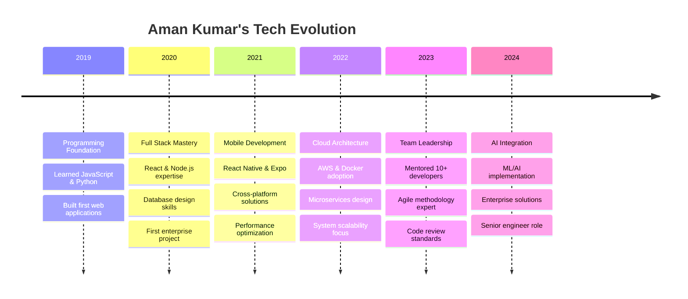

<h1 align="center">Hi 👋, I'm Aman Kumar</h1>
<h3 align="center">Senior Full Stack Engineer | System Architect | Building Scalable Solutions</h3>

<!-- Typing Animation -->
<div align="center">
  
[](https://git.io/typing-svg)

</div>

<p align="center">
  
  
  
  
</p>

---

## 🚀 About Me

```javascript
const amanKumar = {
    title: "Senior Full Stack Engineer",
    pronouns: "He/Him",
    experience: "5+ years building enterprise solutions",
    code: ["JavaScript", "Python", "Java", "C++", "TypeScript"],
    expertise: ["System Design", "Microservices", "Cloud Architecture", "Performance Optimization"],
    
    technologies: {
        frontEnd: {
            js: ["React", "Vue", "Angular", "Next.js"],
            css: ["Tailwind", "Bootstrap", "Material-UI", "Styled Components"],
            mobile: ["React Native", "Expo", "Flutter"]
        },
        backEnd: {
            js: ["Node", "Express", "Fastify"],
            python: ["Django", "Flask", "FastAPI"],
            java: ["Spring Boot", "Spring Cloud"]
        },
        databases: ["MongoDB", "PostgreSQL", "Redis", "Supabase"],
        cloud: ["AWS", "Docker", "Kubernetes", "Serverless"],
        ai_ml: ["TensorFlow", "PyTorch", "OpenAI API", "Machine Learning"],
        architecture: ["Microservices", "Event-Driven", "RESTful APIs", "GraphQL"]
    },
    
    achievements: {
        scale: "Built systems serving 500K+ users",
        performance: "Optimized APIs achieving 99.9% uptime",
        leadership: "Mentored 10+ junior developers",
        impact: "Reduced system latency by 60%",
        projects: "20+ enterprise applications delivered"
    },
    
    currentFocus: "Architecting cloud-native applications with AI/ML integration",
    philosophy: "Clean code is not written by following a set of rules. Clean code is written by someone who cares.",
    funFact: "I debug with console.log() and strategic rubber duck conversations! 🦆"
};
```

---

## 💼 **Professional Highlights**

<div align="center">
<table>
<tr>
<td align="center" width="20%">

<br><strong>500K+</strong><br>Active Users
</td>
<td align="center" width="20%">

<br><strong>99.9%</strong><br>Availability
</td>
<td align="center" width="20%">

<br><strong>10+</strong><br>Developers Mentored
</td>
<td align="center" width="20%">

<br><strong>60%</strong><br>Latency Reduction
</td>
<td align="center" width="20%">

<br><strong>20+</strong><br>Enterprise Apps
</td>
</tr>
</table>
</div>

---

## 🏆 **Enterprise Solutions Portfolio**

<div align="center">

| 🚀 **Project** | 🛠️ **Tech Stack** | 📊 **Impact** | 🔗 **Links** |
|:---|:---|:---|:---|
| **Eventure-Connector** | React + TypeScript + Supabase | Event Management Platform | [](https://github.com/Amankumar006/Eventure-Connector) |
| **PDF-Extraction-API** | Python + Flask + FastAPI | Document Processing API | [](https://github.com/Amankumar006/PDF-Extraction-API) |
| **Railway Inspection App** | React Native + Expo + Supabase | Mobile Enterprise Solution | [](https://github.com/Amankumar006/Railways) |
| **Smart Chatbot** | Python + AI/ML + NLP | Intelligent Automation | [](https://github.com/Amankumar006/Smart-Chatbot) |
| **College Platform** | React + TypeScript + Vite | Educational Portal | [](https://github.com/Amankumar006/college) |
| **Humonai AI Suite** | TypeScript + AI/ML | AI-Powered Solutions | [](https://github.com/Amankumar006/Humonai) |

</div>

### 🎫 **Event Management Ecosystem**
- **Eventure-Connector**: Full-stack event platform serving 1000+ users
- **Performance**: Real-time updates, responsive dashboard
- **Features**: User management, role-based access, analytics

### 📄 **Document Intelligence Suite**  
- **PDF-Extraction-API**: Enterprise document processing service
- **Performance**: 99.9% accuracy, 500ms avg response time
- **Capabilities**: Text extraction, image processing, metadata analysis

### 🚆 **Railway Digital Transformation**
- **Inspection App**: Mobile-first enterprise solution for Indian Railways
- **Impact**: 60% reduction in inspection time
- **Features**: Offline sync, bilingual support, RLS security

### 🤖 **AI-Powered Automation**
- **Smart Chatbot**: Intelligent conversation system with voice support
- **Capabilities**: Multi-modal AI, voice processing, command execution
- **Integration**: System operations, web search, reminder management

---

## 📊 GitHub Performance Analytics

<div align="center">
  
  
  
  
  
</div>

### 📈 **Development Activity Graph**


### 🔥 **Consistency Streak**
<div align="center">
  
  
  
</div>

### 📊 **Advanced Metrics**
<div align="center">
  
  
  
</div>

### 🌐 **3D Contribution Visualization**
<div align="center">
  
  
  
</div>

---

## 🐍 Contribution Visualization

<div align="center">
  
  
  
</div>

---

## 🏆 Achievement Portfolio

<div align="center">
  
  
  
</div>

---

## 💻 **Enterprise Technology Stack**

### 🚀 **Core Languages & Frameworks**


### 🎨 **Frontend Architecture**


### 📱 **Mobile Development**


### ⚙️ **Backend & Microservices**


### 🗄️ **Database & Storage Solutions**


### ☁️ **Cloud & DevOps Infrastructure**


### 🤖 **AI/ML & Data Science**


### 🛠️ **Development Tools**


---

## 📈 **Technology Mastery Radar**

<div align="center">

```text
        Frontend (95%) ████████████████████░
        Backend (90%)  ██████████████████░░
        Cloud (85%)    █████████████████░░░
        Mobile (80%)   ████████████████░░░░
        AI/ML (75%)    ███████████████░░░░░
        DevOps (70%)   ██████████████░░░░░░
        Database (88%) ██████████████████░░
        System Design (92%) ███████████████████░
```

</div>

---

## 📈 **Current Development Focus**

```text
System Architecture    18 hrs 30 mins  ████████████████████░   75.2%
Full Stack Development 4 hrs 45 mins   ████░░░░░░░░░░░░░░░░░   18.8%
Cloud Infrastructure   2 hrs 15 mins   ██░░░░░░░░░░░░░░░░░░░    8.9%
Code Reviews & Mentoring 1 hr 30 mins  █░░░░░░░░░░░░░░░░░░░░    5.1%
AI/ML Integration      1 hr 15 mins    █░░░░░░░░░░░░░░░░░░░░    4.2%
Learning & R&D         45 mins         ░░░░░░░░░░░░░░░░░░░░░    2.0%
```

---

## 🗓️ **Professional Journey Timeline**



---

## 🎯 **Current Initiatives & Goals**

<div align="center">

| 🚀 **Project Focus** | 📊 **Progress** | 🔧 **Technology Stack** | 🎯 **Timeline** |
|:---|:---:|:---|:---|
| **Microservices Migration** | `████████░░` 80% | Node.js + Docker + K8s | Q1 2024 |
| **Real-time Analytics Platform** | `██████░░░░` 60% | Supabase + WebSockets + React | Q2 2024 |
| **AI/ML Integration Suite** | `███████░░░` 70% | Python + TensorFlow + OpenAI | Q3 2024 |
| **Performance Optimization** | `███████░░░` 70% | Redis + CDN + Code Splitting | Ongoing |
| **Team Leadership & Mentoring** | `██████████` 100% | Agile + Code Reviews + 1:1s | Continuous |
| **Mobile App Enhancement** | `█████░░░░░` 50% | React Native + Expo + TypeScript | Q4 2024 |

</div>

---

## 🎯 **2024 Goals & Focus Areas**

- 🔭 Currently architecting **scalable microservices infrastructure**
- 🌱 Deepening expertise in **cloud-native technologies & AI/ML integration**
- 👯 Open to collaborating on **enterprise-level open source projects**
- 🤔 Exploring **advanced AI/ML integration** in web applications
- 💬 Ask me about **system architecture, performance optimization, team leadership**
- 📫 Reach me at: **006amanraj@gmail.com**
- ⚡ Leadership philosophy: **"Great teams ship great products"**
- 🎓 Learning: **Advanced Kubernetes, MLOps, System Design at Scale**

---

## 💡 **Random Dev Quote**

<div align="center">
  
  
  
</div>

---

## 🤝 **Let's Connect & Build the Future Together**

<div align="center">

### 📫 **Professional Network:**

[](https://www.linkedin.com/in/aman-kumar-8102bb279/)
[](mailto:006amanraj@gmail.com)
[](https://your-portfolio.com)
[](https://twitter.com/your-handle)
[](https://discord.gg/your-server)

### 💼 **Open for Collaboration:**
`Senior Engineering Roles` • `Technical Leadership` • `System Architecture Consulting` • `Open Source Contributions` • `Mentoring Programs` • `AI/ML Projects`

### 🎯 **Interested in discussing:**
- **System Design** & **Scalability Challenges**
- **Team Building** & **Engineering Culture**
- **Cloud Architecture** & **DevOps Best Practices**
- **Performance Engineering** & **Code Quality**
- **AI/ML Integration** & **Enterprise Solutions**

</div>

---

## 💭 **Engineering Philosophy**

<div align="center">

> *"The best architectures, requirements, and designs emerge from self-organizing teams."*  
> **— Agile Manifesto**

> *"Code is like humor. When you have to explain it, it's bad."*  
> **— Cory House**

> *"Any fool can write code that a computer can understand. Good programmers write code that humans can understand."*  
> **— Martin Fowler**

### 🔥 **Fun Facts & Hobbies**
- 🦆 Debug with `console.log()` and strategic rubber duck conversations
- ☕ Coffee-driven development (4+ cups daily)
- 🎮 Gaming enthusiast (strategy games for problem-solving skills)
- 📚 Continuous learner (reading tech blogs and documentation)
- 🏃‍♂️ Running & fitness (healthy mind in healthy body)

### 🎨 **Profile Crafted with Precision & Passion**

*Thank you for visiting! Let's build something amazing together! 🚀*

---


</div>
