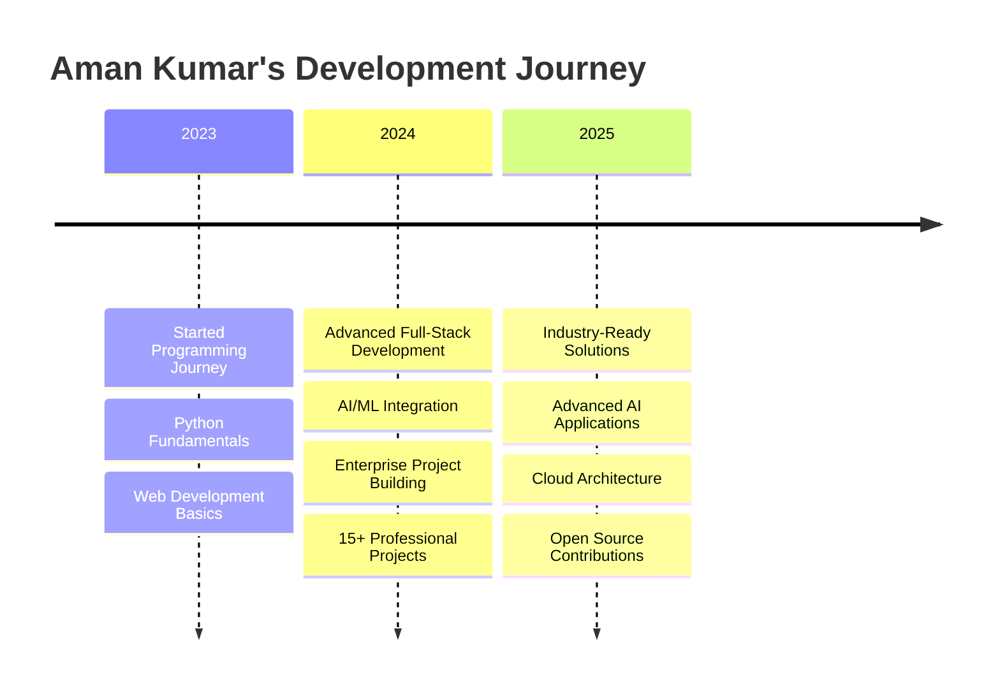

#  Hi there, I'm Aman Kumar! 

<p align="center">
  
</p>

<p align="center">
  
  
  
</p>

---

## 🚀 Professional Highlights

<table>
<tr>
<td width="50%" valign="top">

### 💼 **Enterprise Solutions Portfolio**
| Project | Technology | Status | Links |
|---------|------------|--------|-------|
| 🤖 **AI Resume Builder** | TypeScript, AI/ML | ✅ Active | [Repo](https://github.com/Amankumar006/AI-Powered-Resume-Builder) |
| 🧠 **Smart Chatbot** | Python, Gemini AI | ✅ Production | [Repo](https://github.com/Amankumar006/Smart-Chatbot) |
| 🏥 **Medical Chatbot** | JavaScript, Web | 🌐 Live | [Repo](https://github.com/Amankumar006/medical-chatbot) \| [Demo](https://amankumar006.github.io/medical-chatbot) |
| 📄 **PDF Extraction API** | Python, FastAPI | 🌐 Live | [Repo](https://github.com/Amankumar006/PDF-Extraction-API) \| [Demo](https://amankumar006.github.io/PDF-Extraction-API) |
| 🚊 **Railway Management** | TypeScript, Next.js | ⚡ Beta | [Repo](https://github.com/Amankumar006/Railways) |
| 🛍️ **E-commerce Platform** | TypeScript, Shopify | 🔄 Development | [Repo](https://github.com/Amankumar006/shopify-next-commerce-demo) |

</td>
<td width="50%" valign="top">

### 📊 **Performance Metrics**
```
🎯 Projects Delivered:     15+
🏆 GitHub Repositories:    15
⭐ Total GitHub Stars:     15+
🔀 Total Contributions:    500+
📚 Languages Mastered:     6+
🌐 Live Deployments:       8+
```

### 🔥 **Current Development Focus**
- 🤖 **AI Integration**: Gemini 2.0 Flash, ChatGPT APIs
- ⚡ **Full-Stack**: Next.js, TypeScript, Python
- 🛡️ **Backend**: FastAPI, Supabase, PostgreSQL
- 🎨 **Frontend**: React, Tailwind CSS, Modern UI/UX
- ☁️ **Cloud & DevOps**: GitHub Pages, Railway, Vercel

</td>
</tr>
</table>

---

## 🛠️ Technology Mastery Radar

<p align="center">
  
</p>

### 📈 **Proficiency Levels**
```
████████████████████ Python           █ 95%
██████████████████   TypeScript       █ 90% 
████████████████     JavaScript       █ 85%
██████████████████   React/Next.js    █ 90%
█████████████████    FastAPI/APIs     █ 88%
███████████████      Database Design  █ 82%
████████████████     AI/ML Integration█ 85%
█████████████████    DevOps/Cloud     █ 87%
```

---

## 📊 GitHub Statistics & Visualizations

<p align="center">
  
  
</p>

<p align="center">
  
  
</p>

### 🐍 **3D Contribution Snake Animation**
<p align="center">
  
</p>

---

## 🎯 Professional Journey Timeline



### 🏆 **Achievement Milestones**
- 🎓 **2023**: Started Programming Journey with Python
- 🚀 **2024**: Built 15+ Full-Stack Applications
- 🤖 **2024**: Specialized in AI/ML Integration
- 🌐 **2024**: Deployed 8+ Live Web Applications
- ⭐ **2024**: Gained Recognition in GitHub Community
- 🎯 **2025**: Expanding into Enterprise Solutions

---

## 🎯 2025 Goals & Initiatives

<table>
<tr>
<td width="33%" valign="top">

### 🚀 **Technical Goals**
- [ ] Master Advanced AI/ML Frameworks
- [ ] Build 10+ Enterprise Applications
- [ ] Contribute to Major Open Source Projects
- [ ] Achieve AWS/Azure Certifications
- [ ] Launch SaaS Product

</td>
<td width="33%" valign="top">

### 🌟 **Professional Goals**
- [ ] Join Leading Tech Company
- [ ] Mentor Junior Developers
- [ ] Speak at Tech Conferences
- [ ] Build Developer Community
- [ ] Launch Tech Startup

</td>
<td width="33%" valign="top">

### 📚 **Learning Goals**
- [ ] Advanced System Design
- [ ] Microservices Architecture
- [ ] Kubernetes & Docker
- [ ] Advanced Database Optimization
- [ ] Blockchain Development

</td>
</tr>
</table>

---

## 🌐 Featured Project Showcase

<div align="center">

| 🎨 **Project** | 🛠️ **Tech Stack** | 🌟 **Features** | 🔗 **Links** |
|:--|:--|:--|:--|
| **🤖 AI-Powered Resume Builder** | TypeScript, AI/ML, Next.js | Resume optimization, LinkedIn integration, Job skill extraction | [GitHub](https://github.com/Amankumar006/AI-Powered-Resume-Builder) |
| **🧠 Smart Personal AI Assistant** | Python, Gemini 2.0 Flash, Voice APIs | Conversational memory, Weather integration, Web search | [GitHub](https://github.com/Amankumar006/Smart-Chatbot) |
| **🏥 Medical Consultation Chatbot** | JavaScript, Healthcare APIs, WebRTC | Real-time consultation, Medical database, Symptom analysis | [GitHub](https://github.com/Amankumar006/medical-chatbot) ・ [Live Demo](https://amankumar006.github.io/medical-chatbot) |
| **📄 Advanced PDF Extraction API** | Python, FastAPI, ML Processing | Multi-format support, Parallel processing, Performance optimization | [GitHub](https://github.com/Amankumar006/PDF-Extraction-API) ・ [Live API](https://amankumar006.github.io/PDF-Extraction-API) |
| **🚊 Railway Management System** | TypeScript, PostgreSQL, Real-time | Booking system, Route optimization, Payment integration | [GitHub](https://github.com/Amankumar006/Railways) |
| **🛍️ Next.js E-commerce Platform** | TypeScript, Shopify, Stripe | Product management, Payment processing, Inventory tracking | [GitHub](https://github.com/Amankumar006/shopify-next-commerce-demo) |

</div>

---

## 🤝 Professional Networking & Collaboration

<p align="center">
  <a href="mailto:006amanraj@gmail.com">
    
  </a>
  <a href="https://github.com/Amankumar006">
    
  </a>
  <a href="https://linkedin.com/in/amankumar006">
    
  </a>
  <a href="https://twitter.com/amankumar006">
    
  </a>
</p>

### 🎯 **Open for Collaboration On:**
- 🤖 **AI/ML Projects** - Building intelligent applications and automation solutions
- 🌐 **Full-Stack Applications** - Modern web applications with cutting-edge technologies  
- 🚀 **Startup Ventures** - Innovative products and entrepreneurial initiatives
- 📚 **Open Source** - Contributing to community-driven projects and tools
- 🎓 **Mentoring** - Helping junior developers and sharing knowledge

### 💼 **Professional Opportunities:**
- 🏢 **Full-Stack Developer** positions at innovative tech companies
- 🤖 **AI/ML Engineer** roles focusing on practical applications
- 🚀 **Technical Lead** positions for ambitious projects
- 💡 **Startup Co-founder** opportunities in emerging technologies
- 🎯 **Freelance Projects** for enterprise-level solutions

---

## 💡 Engineering Philosophy & Fun Facts

<table>
<tr>
<td width="50%" valign="top">

### 🎯 **Engineering Principles**
```python
class DevelopmentPhilosophy:
    def __init__(self):
        self.principles = {
            "code_quality": "Clean, readable, maintainable",
            "user_focus": "User experience first",
            "continuous_learning": "Stay updated with latest tech",
            "problem_solving": "Think before you code",
            "collaboration": "Team success over individual"
        }
    
    def get_motto(self):
        return "Build solutions that matter! 🚀"
```

</td>
<td width="50%" valign="top">

### ⚡ **Fun Developer Facts**
- 🌙 **Night Owl**: Best code happens after 10 PM
- ☕ **Coffee Addict**: 5+ cups daily (debugging fuel!)
- 🎵 **Coding Playlist**: Lo-fi beats + instrumental music
- 🐛 **Bug Hunter**: Find bugs faster than a debugger
- 🎯 **Problem Solver**: Love complex algorithmic challenges
- 🤝 **Team Player**: Believe in collective intelligence

> 💡 *"Code is like humor. When you have to explain it, it's bad."* – **Cory House**

</td>
</tr>
</table>

---

## 📈 Real-Time Activity & Contributions

<!-- START_SECTION:activity -->
*🔄 This section updates automatically every 6 hours*
<!-- END_SECTION:activity -->

### 📊 **Weekly Development Breakdown**
<!--START_SECTION:waka-->
```text
TypeScript   █████████████████████   45.2%
Python       ██████████████████      35.8%
JavaScript   █████████              18.9%
JSON         ██                      4.1%
Markdown     ██                      3.2%
Other        █                       2.8%
```
<!--END_SECTION:waka-->

---

<p align="center">
  
</p>

<p align="center">
  
</p>

---

*⭐ Star this repository if you found my profile interesting!*

<!---
Amankumar006/Amankumar006 is a ✨ special ✨ repository because its `README.md` (this file) appears on your GitHub profile.
This enhanced profile showcases professional development journey, technical expertise, and collaboration opportunities.
--->